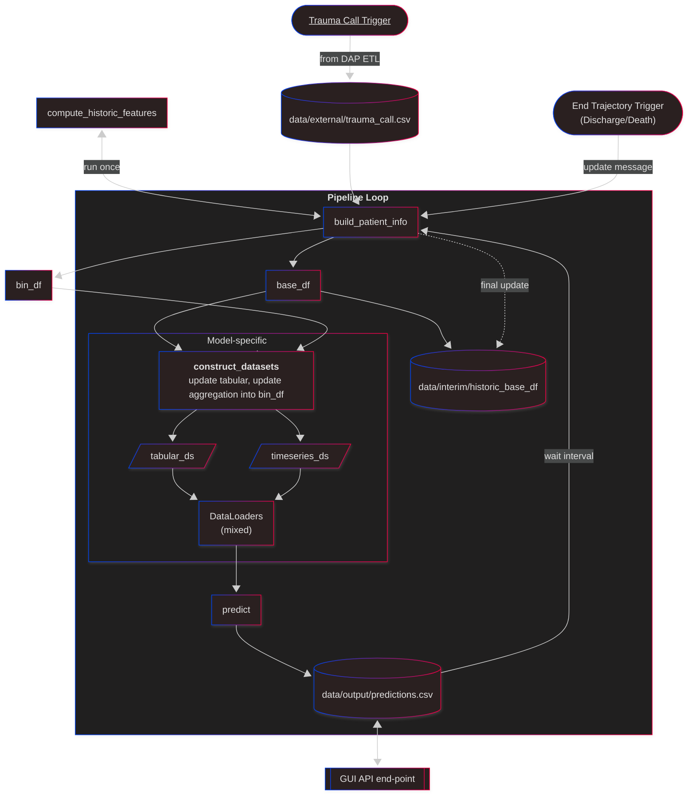

# ASTRA - AI for Surgical Trauma Risk Assessment
<i>Center for Surgical Translational and Artificial Intelligence Research (CSTAR), Copenhagen University Hospital, Denmark</i>

As a part of the ASTRA project by CSTAR, an ML-driven risk assessment tool for trauma patients is developed for implementation in the Eletronic Health Record (EHR) system at the Copenhagen University Hospital. 


### Single patient continious update process graph



### Historic data process graph
```mermaid
---
config:
  layout: dagre
  theme: neo-dark
  look: neo
---
flowchart TB
    A["Blobstore: SP-data"] -- Patient level filtering (Trauma call) --> B["data/raw"]
    B -- Constructing historical and static data --> C1["data/interim/base_df"]
    B -- "Temporal Filtering: In-hospital Data Filtering" --> C["data/interim/concepts"]
    C -- Mapping to bin_df by aggregation --> D["data/interim/mapped"]
    D <-- "Pre-proces and transform" --> E["TSDS Data Class"]
    E --> F["Tabular Dataset"] & G["Timeseries Dataset"]
    F --> F1["Tabular dataloader<br>(FastAI)"]
    G --> G1["Timeseries dataloader<br>(FastAI)"]
    F1 --> M["Mixed dataloader<br>(TSAI)"]
    G1 --> M